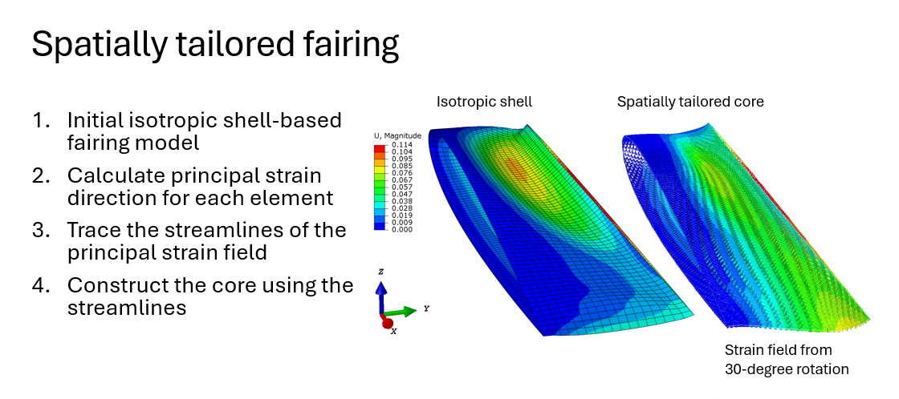
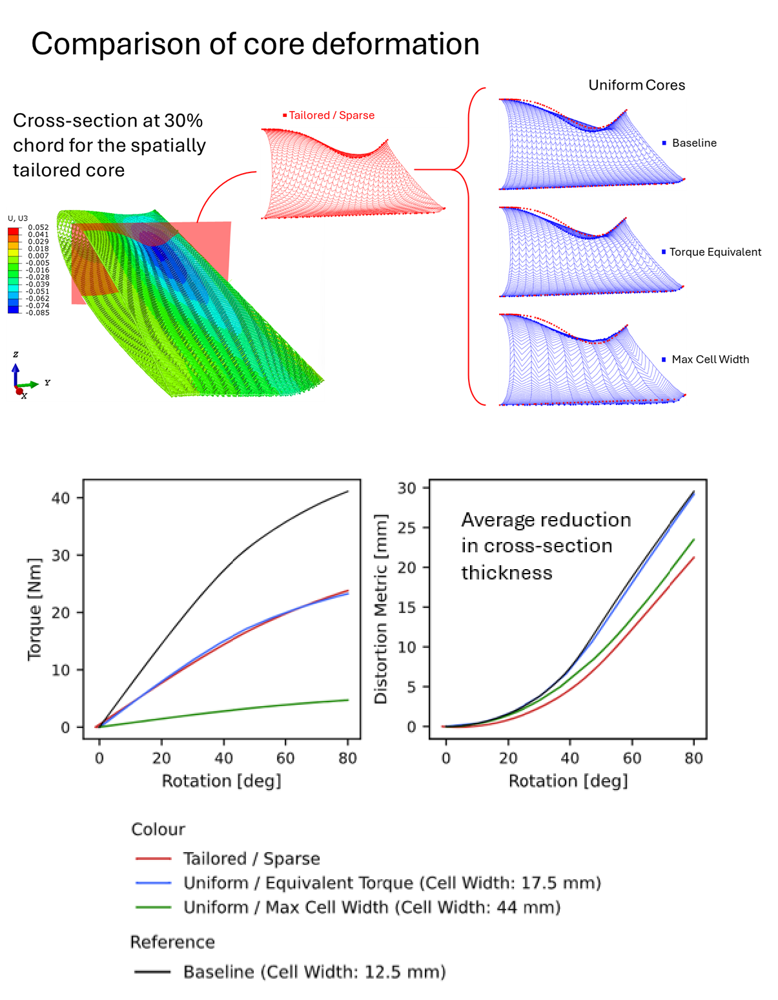

*This is work in progress*

The main idea is to use the strain field of a deformed structure to guide the generation of a spatially tailored structure that improve its compliance for morphing applications.

The process is shown below: 

As for why do this? It give significant improvement in performance for the morphing fairing as shown below:
