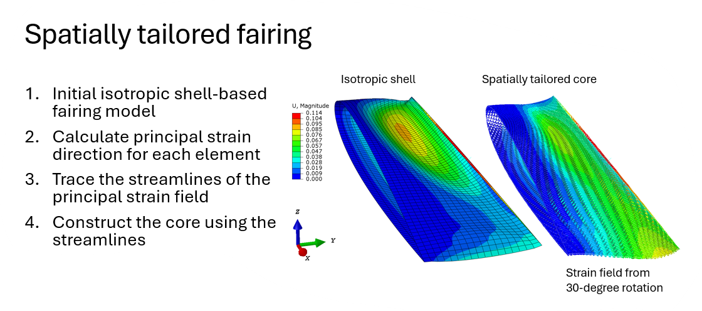
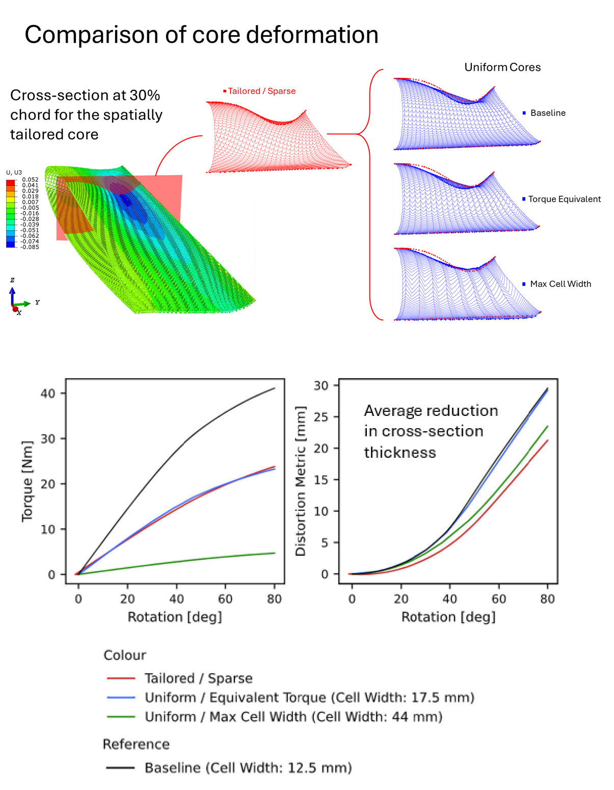

# Spatial Tailoring of Morphing Fairing Panels

> **Work in progress**

## Overview

This repository implements a computational framework for **spatially tailoring** the internal architecture of a accordion core sandwich fairing panel so that its compliance is maximised for a target morphing deformation.

The core idea is to extract the principal-strain and principal-curvature fields from a homogenised finite-element analysis of the deformed fairing, then use those fields to orient the unit cells of the core locally across the panel — reducing the structural stiffness in the directions that matter most for morphing.



The approach yields significant improvements in reducing cross-section distortion of the fairing while the wingtip folds:



The code models the detailed geometry of the sandwich panel over the wing section using shell elements.

---

## Repository Structure

```
├── DEFAUTLS.py          # Default parameter dictionaries for RVE and FairingGeometry
├── RVE.py               # Unit-cell (RVE) geometry, mesh generation, and stiffness homogenisation
├── Fairing.py           # Fairing-panel geometry and mesh generation (equivalent & explicit models)
├── Tailoring.py         # Field-line tracing and lattice generation for spatial tailoring
├── Mesh.py              # Mesh data structures (nodes, elements, sets)
├── Utils.py             # Shared utilities: I/O, geometry ops, unit conversions, plotting
├── Plotting.py          # Standalone script for post-processing response plots
├── aerofoil_database/   # .dat coordinate files for standard aerofoil profiles
├── default_case/        # Default run directory (inputs, outputs, figures)
└── images/              # Figures used in documentation
```

---

## Workflow

The analysis follows three main stages:

### 1. RVE Analysis
Run a periodic unit-cell (RVE) finite-element analysis to homogenise the effective shell stiffness (ABD matrix) of the chevron-core sandwich panel.

```python
directory = Utils.Directory("Example")
RVE = RVE(
    directory=directory,
    case_number=0
)
RVE.analysis()
```

### 2. Fairing Analysis (Equivalent Model)
Build a homogenised shell model of the full fairing and run an Abaqus analysis to obtain the deformation field.

```python
fairing = FairingAnalysis(
    variables={
        "rotation_angle": Utils.Units.deg2rad(15.0),
        "solver":"newton",
        "model_fidelity_settings":{
            "equivalent":{
                "bool_isotropic": False,
            }
        },
    },  
    directory=directory,
    case_number=0,
    RVE_identifier=0
)
fairing.analysis()
```

### 3. Spatial Tailoring (Explicit Model)
Trace principal-field lines over the deformed surface and generate a spatially tailored model of the sandwich panel fairing.

```python
tailored = FairingAnalysis(
    variables={
        "element_size": 0.02,
        "rotation_angle": Utils.Units.deg2rad(15.0),
        "solver": "dynamic",  
        "model_fidelity": "explicit",
        "model_fidelity_settings": {
            "explicit": {
                "reference_case": 0,  # source file for field
                "reference_field": 0,  # increment of field
            },
        },
    },
    RVE_identifier=0,
    directory=directory,
    case_number=1,
)
tailored.analysis()
```

---

## Key Parameters

| Parameter | Default | Description |
|---|---|---|
| `chevron_angle` | 60° | Angle of the chevron arms relative to the spanwise direction |
| `chevron_wall_length` | 30 mm | Length of a single chevron arm |
| `chevron_pitch` | 10 mm | Chordwise spacing between adjacent chevrons |
| `core_thickness` | 26 mm | Thickness of the core |
| `facesheet_thickness` | 0.5 mm | Thickness of each facesheet |
| `fairing_chord` | 1.6 m | Chord of the fairing|
| `fairing_span` | 0.8 m | Span of the fairing |
| `model_fidelity` | `"equivalent"` | `"equivalent"` (homogenised shell) or `"explicit"` (detailed panel geometry) |

---

## Dependencies

Install all Python dependencies with:

```bash
pip install -r requirements.txt
```

The following external software is also required:

- **[GMSH](https://gmsh.info/)** — mesh generation (`gmsh` Python API)
- **[Abaqus](https://www.3ds.com/products-services/simulia/products/abaqus/)** — finite-element solver (commercial licence required)

---

## License

This project is released under the [MIT License](LICENSE).

---

## Citation

If you use this work in academic research, please cite the associated publication (forthcoming).
